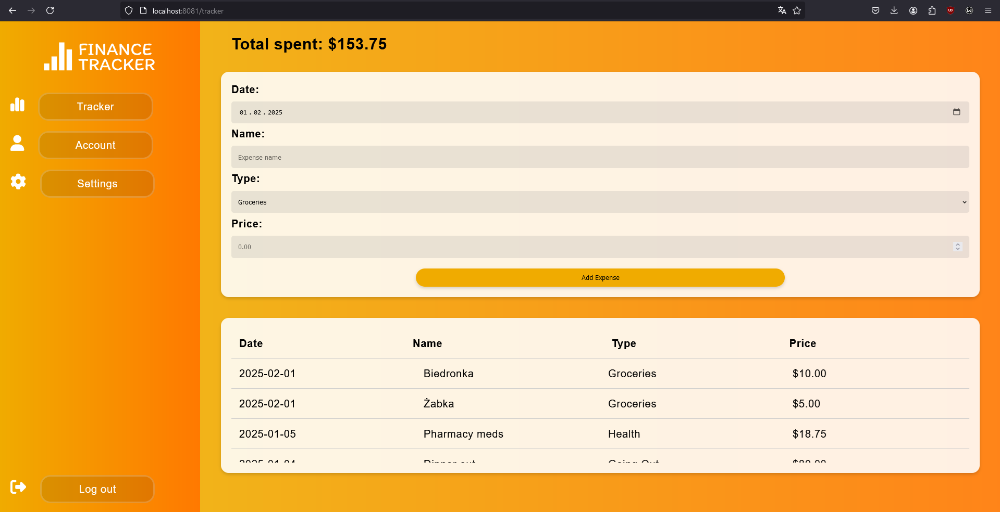
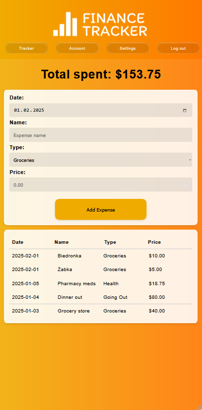

# Finance tracker
Web app created with PHP as a final project of a university course.

## Table of contents
* [General info](#general-info)
* [Technologies](#technologies)
* [Setup](#setup)
* [Features](#features)
* [Status](#status)
* [Sources](#sources)

## General info
Finance Tracker is a web application designed to help users manage their budget and track expenses. 
The project features role-based authentication, allowing both regular users and administrators to interact with the system. 
Regular users can add, view, and track expenses, while administrators have access to an admin panel to manage users.

## Technologies
- **PHP** – The main programming language used for the server-side logic.
- **PostgreSQL** – Database management system to store user information, expenses, and roles.
- **HTML/CSS** – For creating the user interface.
- **JavaScript (Fetch API)** – For asynchronous communication with the backend (e.g., adding expenses without page reload).

### Database Schema


## Setup
1. **Clone the Repository:**
   ```bash
   git clone https://github.com/Arwers/WdPAI.git
   cd WdPAI
   ```

1. **turn on docker container:**
   ```bash
   docker-compose up -d
   ```

2. **Launch website:**
    ```bash
        http://localhost:8081/index
    ```

3. **Accounts for testing:**
    - **Admin Account:**
        - **Email:** admin@example.com
        - **Password:** admin123
    - **Client Account:**
        - **Email:** client@example.com
        - **Password:** client123
    
## Features
### Implemented (PC view):
- **Login page:**  
  

- **Registration form:**  
  

- **Admin Panel:**  
  

- **Finance tracker:**  
  
### Implemented (Mobile view):
- **Login page:**  
  

- **Registration form:**  
  

- **Admin Panel:**  
  

- **Finance tracker:**  
  

## Status
#### 🟢 Active
Project is in active development

## Sources
* [WdPAI course](https://www.youtube.com/watch?v=SLxf1ZhlqOQ&list=PLtx5mWTs0kiWv_JaaRF1OfCvg-aFgl18z)